# Oracle

## Crea un rol ROLPRACTICA con los privilegios (no roles) necesarios para conectarse a la base de datos, crear tablas y vistas e insertar datos en la tabla EMP de SCOTT.

```sql
-- 
ALTER SESSION SET CONTAINER = ORCLPDB1;

-- creamos el rol, tiene que llevar C## antes del nombre
CREATE ROLE ROLPRACTICA;

-- le damos los privilegios sobre el sistema
GRANT CREATE SESSION TO ROLPRACTICA;
GRANT CREATE TABLE TO ROLPRACTICA;
GRANT CREATE VIEW TO ROLPRACTICA;

-- le damos los privilegios sobre la tabla emp de scott
GRANT INSERT ON SCOTT.EMP TO ROLPRACTICA;
```

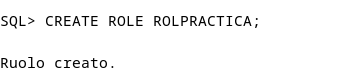

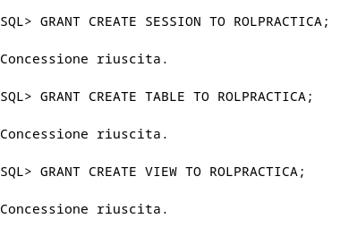

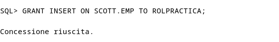

## Crea un usuario USRPRACTICA con el tablespace USERS por defecto y averigua que cuota se le ha asignado por defecto en cada tablespace. Ponle una cuota de 1M en USERS

```sql
CREATE USER USERPRACTICA 
IDENTIFIED BY "password"
DEFAULT TABLESPACE users;


SELECT tablespace_name,
       bytes,
       max_bytes
FROM dba_ts_quotas
WHERE username = 'USERPRACTICA';
```

- Como podemos ver, no hay ninguna linea, eso quiere decir que no existe una cuata por defecto para cuando no seleccionamos una

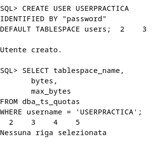

```
DROP USER USERPRACTICA;

CREATE USER USERPRACTICA 
IDENTIFIED BY "password"
DEFAULT TABLESPACE users
QUOTA 1M ON users;
```

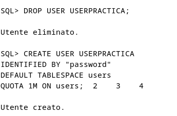

- Como podemos ver ahora si sale la cuota

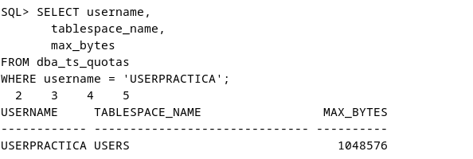

## Modifica el usuario USRPRACTICA para que tenga cuota 0 en el tablespace SYSTEM

- Al modificar la cuata a 0, eso hace que el usuario no pueda insertar datos de los tablespaces que tenga con esa cuota

```sql
ALTER USER USERPRACTICA
QUOTA 0 ON SYSTEM;
```

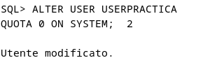

```sql
SELECT username,
       tablespace_name,
       max_bytes
FROM dba_ts_quotas
WHERE username = 'USERPRACTICA';

SELECT username,
       tablespace_name,
       max_bytes
FROM dba_ts_quotas
WHERE username = 'USERPRACTICA'
  AND tablespace_name = 'SYSTEM';
```

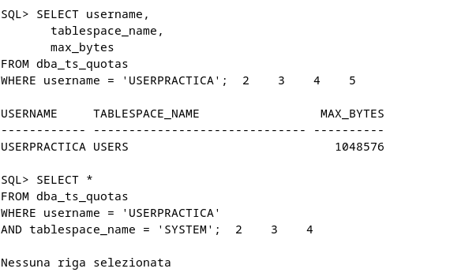

- Al estar a 0 no sale

## Concede a USRPRACTICA el ROLPRACTICA.

```
GRANT ROLPRACTICA TO USERPRACTICA;
```

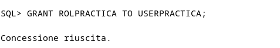

- Lo podemos comprobar con el siguienete comando

```sql
SELECT grantee, granted_role
FROM dba_role_privs
WHERE grantee = 'USERPRACTICA';
```

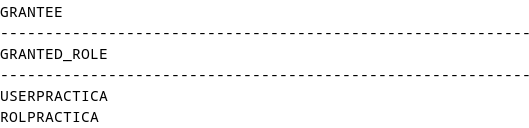

## Crea un perfil ESCLAVO que limita a uno el número de minutos de inactividad permitidos en una sesión y a ocho minutos el tiempo máximo de duración de una sesión.

```sql
CREATE PROFILE ESCLAVO
LIMIT
    IDLE_TIME 1
    CONNECT_TIME 8;
```

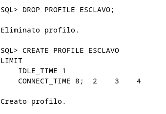

## Activa el uso de perfiles en ORACLE. Modifica el perfil ESCLAVO poniendo el parámetro COMPOSITE LIMIT en su valor mínimo. Comprueba cuántas operaciones se pueden realizar.

- Lo activamos con el siguiente comando

```sql
ALTER SYSTEM SET RESOURCE_LIMIT = TRUE;
```

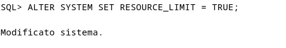

- Y podemos comprobar que está activado de la siguiente forma

```sql
SHOW PARAMETER resource_limit;
```

- Como podemos ver está en true

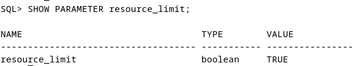


- A continuación lo ponemos en 1

```sql
ALTER PROFILE ESCLAVO
LIMIT
    COMPOSITE_LIMIT 1;
```

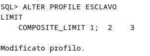

- Comprobamos que está añadido haciendo la siguiente consulta

```sql
SELECT profile,
       resource_name,
       limit
FROM dba_profiles
WHERE profile = 'ESCLAVO'
AND RESOURCE_NAME = 'COMPOSITE_LIMIT';
```

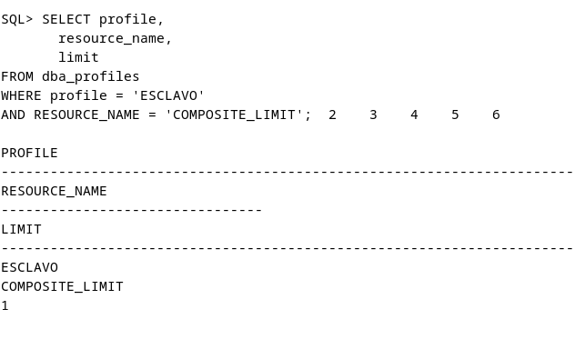

- Pero para comprobar el funcionamiento real, obligatoriamente tenemos que añadirle el perfil a un usuario

## Asigna el perfil creado a USRPRACTICA y comprueba su correcto funcionamiento

```sql
ALTER USER USERPRACTICA PROFILE ESCLAVO;
```

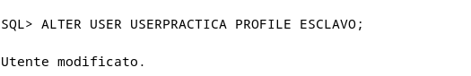

- Para comprobar el límite real vamos a hacer varias consultas a ver cuantas aguanta antes de cerrarse

--- no me funciona ---

## Crea un perfil CONTRASEÑASEGURA especificando que la contraseña caduca semanalmente y sólo se permiten dos intentos fallidos para acceder a la cuenta. En caso de superarse, la cuenta debe quedar bloqueada por un mes

```sql
CREATE PROFILE CONTRASEÑASEGURA
LIMIT
  PASSWORD_LIFE_TIME 7
  FAILED_LOGIN_ATTEMPTS 2
  PASSWORD_LOCK_TIME 30;
```

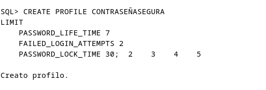

## Asigna el último perfil creado a USRPRACTICA y comprueba su funcionamiento. Desbloquea posteriormente al usuario.

- Lo asignamos usando el siguiente comando

```sql
ALTER USER USERPRACTICA
PROFILE CONTRASEÑASEGURA;
```

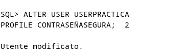

- Y se puede verificar de la siguiente forma

```sql
SELECT profile,
  resource_name,
  limit
FROM dba_profiles
WHERE profile = 'CONTRASEÑASEGURA'
AND resource_name IN (
  'PASSWORD_LIFE_TIME',
  'FAILED_LOGIN_ATTEMPTS',
  'PASSWORD_LOCK_TIME'
);
```

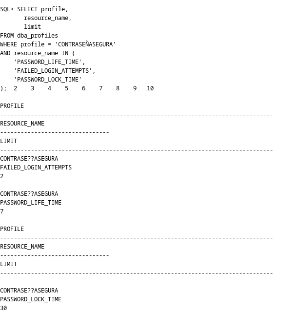

- A los tres intentos nos saldrá que la cuenta está bloqueada

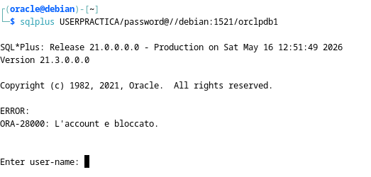

- Para desbloquear el usuari se haría con la siguiente sentencia

```sql
ALTER USER USERPRACTICA ACCOUNT UNLOCK;
```

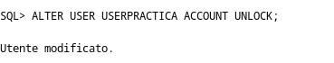

- Y para probar que verdaderamente está desbloqueado iniciamos sesion

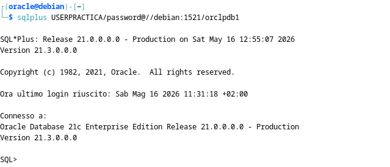

- Como podemos ver ya no está bloqueada

## Elige un usuario concreto y consulta qué cuota tiene sobre cada uno de los tablespaces

- Vamos a usar la tabla dba_ts_quotas, lo primero que ahremos será un describe para ver los campos de esa tabla

```sql
DESCRIBE USER_TS_QUOTAS;
```

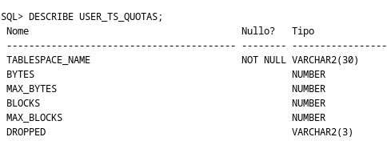

- De aqui los que necesitamos son el usuario, el nombre del tablespace y el maximo de bytes que puede ocupar


```sql
SELECT username,
  tablespace_name,
  max_bytes
FROM dba_ts_quotas
WHERE username = 'USERPRACTICA';
```

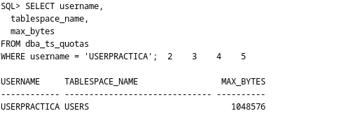

- Como podemos ver, este usuario solo tiene la cuata de un mb que añadimos anteriormente, esto se debe a que nuestra base de datos no funciona usando un sistema de cuotas


## Consulta qué usuarios existen en tu base de datos con la cuota de algún tablespace gastada en más de un 50%

- Para esto vamos a usar una regla de tres para calcular el porcentaje usando el máximo de bits posibles y los bits que hay

```sql
SELECT username,
  tablespace_name,
  ROUND((bytes * 100) / max_bytes, 2) AS porcentaje_usado
FROM dba_ts_quotas
WHERE max_bytes > 0
AND (bytes * 100) / max_bytes > 50;
```

- Esto nos muestra el nombre de usuario, el del tablesace y el porcentaje usado el cual solo saldra si es mayor del 50%

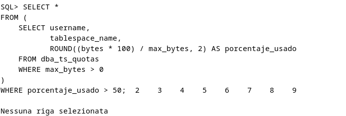

- No sale nada porque no hay ninguna que esté usando más del 50% de cuotas, podemos ver que el fallo es por eso haciendo la siguiente consulta en la que nos mostrarán las menores de 50

```sql
SELECT username,
  tablespace_name,
  bytes,
  max_bytes,
  ROUND((bytes * 100) / max_bytes, 2) AS porcentaje_usado
FROM dba_ts_quotas
WHERE max_bytes > 0;
```

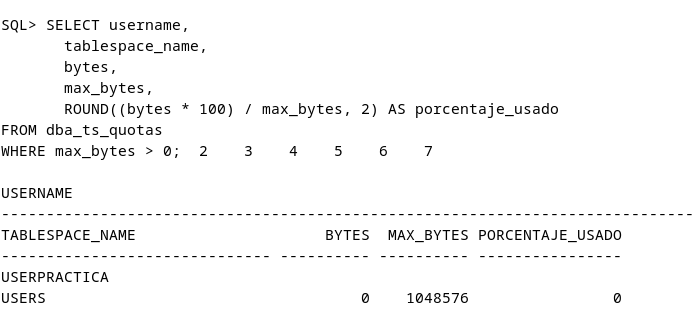

## Elige un usuario concreto y muestra qué privilegios de sistema tiene asignados

- Para eso vamos a usar la tabla dba_sys_privs, lo primero que haremos será hacer un describe para ver lo que hay en esa tabla

```
DESCRIBE dba_sys_privs;
```

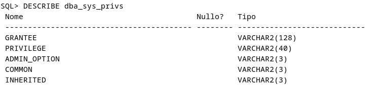

- Ahora que ya sabemos el contenido de la tabla haremos la siguiente consulta

```sql
SELECT grantee,
  privilege
FROM dba_sys_privs
where grantee = 'USUARIO1';
```

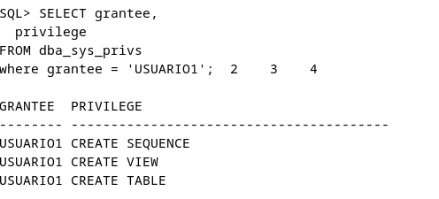

- Pero puede que el usuario no tenga privilegios, sino que sea el rol asignado el que los tenga, para eso vamos a mirar otra tabla distinta la cual es dba_role_privs, haremos un describe para ver el contenido de la tabla

```sql
DESCRIBE dba_role_privs;
```

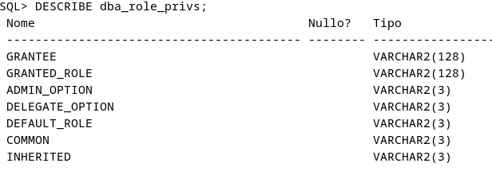

```
SELECT grantee,
  granted_role
FROM dba_role_privs
where grantee = 'USERPRACTICA';
```

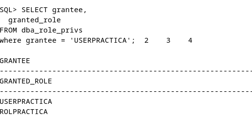

- Ahora que ya savemos el rol que tiene asignado ese perfil veremos los privilegios de ese rol

```sql
SELECT grantee,
  privilege
FROM dba_sys_privs
where grantee = 'ROLPRACTICA';
```

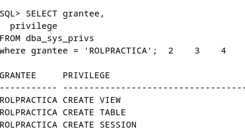


## Elige un usuario concreto y muestra qué privilegios sobre objetos tiene asignados con la posibilidad de concederlos a otro usuario

- Para ver los privilegios sobre objetos veremos la tabla dba_tab_privs, como anteriormente lo primero que haremos será un describe para ver el contenido

```sql
DESCRIBE dba_tab_privs
```

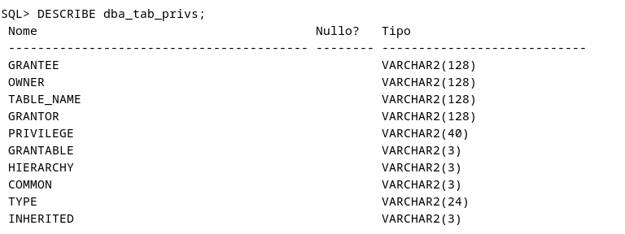

- Ahora haremos la consulta para ver los privilegios sobre objetos que tienen posibilidad de concederse a otro usuario

```sql
SELECT grantee,
  table_name,
  privilege,
  grantable
FROM dba_tab_privs
WHERE grantee = 'USERPRACTICA';
```

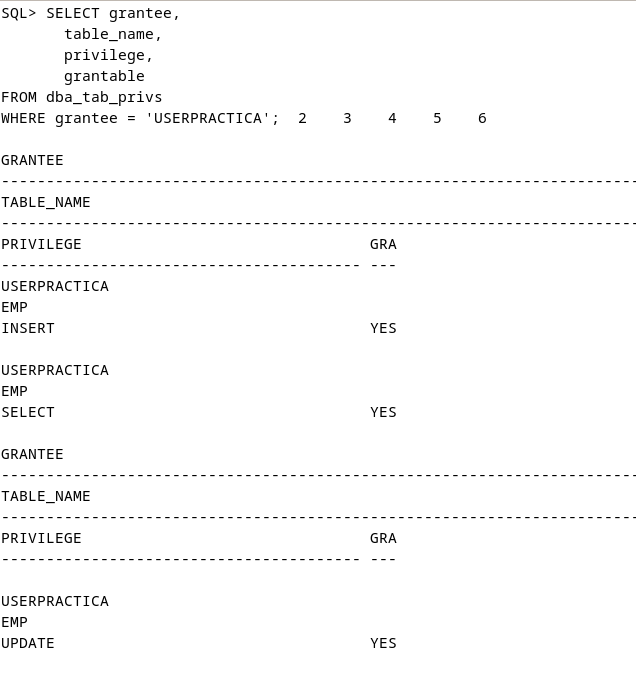

## Elige un rol concreto y consulta qué usuarios lo tienen asignado.

- Eso se mira en la tabla dba_roles_privs, lo primero que haremos será un describe

```sql
DESCRIBE dba_roles_privs;
```

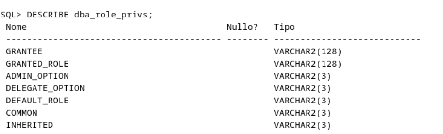

- Y ahora hacemos la consulta

```sql
SELECT grantee,
  granted_role
FROM dba_role_privs
WHERE granted_role = 'ROLPRACTICA';
```

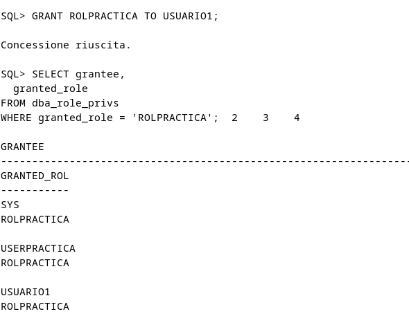

## Elige un rol concreto y averigua si está compuesto por otros roles o no. La consulta debe responder SI o NO.

## Elige un perfil y consulta qué límites se establecen en el mismo

- Esto lo haremos fijandonos en la vista dba_profiles, lo primero que haremos será hacer un describe de la vista

```sql
DESCRIBE dba_profiles;
```

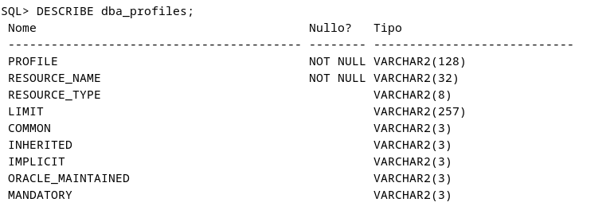

- Ahora hacemos el select para hacer lo que se nos pide

```sql
SELECT profile,
  resource_name,
  limit
FROM dba_profiles
WHERE profile = 'ESCLAVO';
```

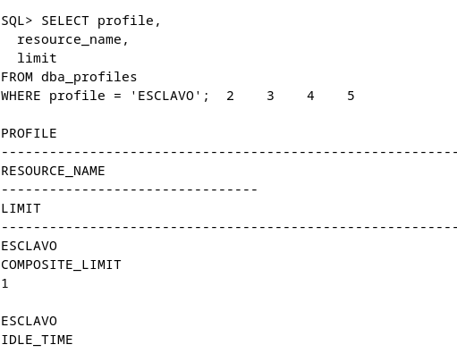

## Realiza un procedimiento que reciba un nombre de usuario y un privilegio de sistema y nos muestre el mensaje 'SI, DIRECTO' si el usuario tiene ese privilegio concedido directamente, 'SI, POR ROL' si el usuario tiene ese privilegio en alguno de los roles que tiene concedidos y un 'NO' si el usuario no tiene dicho privilegio. Debes realizar el procedimiento empleando la técnica de la recursividad para contemplar infinitos niveles de roles anidados

```
CREATE OR REPLACE PROCEDURE RELACIONUSERYPRIVILEGIO (
  usuario     IN VARCHAR2,
  privilegio  IN VARCHAR2
)
IS
BEGIN
  SI();
  SIPORROL();
  NO();
END;
/
```

## Realiza un procedimiento llamado MostrarTiempoSesión que reciba un nombre de usuario y muestre el tiempo máximo de una sesión y el que ha transcurrido realmente en cada una de las sesiones que tenga abiertas.


# Postgres

## Averigua que privilegios de sistema hay en Postgres y como se asignan a un usuario

### Nivel de Base de Datos
- CONNECT: Permite conectarse a una base de datos específica.  
- CREATE: Permite crear nuevos esquemas dentro de la base de datos.  
- TEMP / TEMPORARY: Permite crear tablas temporales durante la sesión.  

### Nivel de Esquema
- CREATE: Permite crear objetos (tablas, vistas, funciones, etc.) dentro del esquema.  
- USAGE: Permite acceder al esquema y a sus objetos (sin este permiso no se pueden usar).  

### Nivel de Tabla
- SELECT: Permite leer los datos de la tabla.  
- INSERT: Permite añadir nuevas filas.  
- UPDATE: Permite modificar filas existentes.  
- DELETE: Permite eliminar filas.  
- TRUNCATE: Permite vaciar completamente la tabla de forma rápida.  
- REFERENCES: Permite crear claves externas que apunten a la tabla.  
- TRIGGER: Permite crear triggers asociados a la tabla.  

### Nivel de Columna
- SELECT: Permite leer valores de columnas específicas.  
- INSERT: Permite insertar valores en columnas concretas.  
- UPDATE: Permite modificar columnas específicas.  
- REFERENCES: Permite usar columnas en claves externas.  

### Nivel de Secuencia
- USAGE: Permite usar la secuencia (por ejemplo, con nextval o currval).  
- SELECT: Permite consultar el valor actual de la secuencia.  
- UPDATE: Permite modificar el valor de la secuencia.  

### Funciones / Procedimientos
- EXECUTE: Permite ejecutar funciones o procedimientos almacenados.  


Los privilegios se asignan mediante el comando GRANT:


```sql
GRANT privilegios
ON objeto
TO usuario;
```

## Averigua cual es la forma de asignar y revocar privilegios sobre una tabla concreta en Postgres

